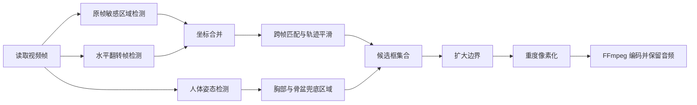

# FrameShield：自动视频隐私马赛克

一个本地运行的视频隐私处理工具。它逐帧识别高风险人体区域，通过双向检测、跨帧追踪和人体姿态兜底提高召回率，再使用重度像素化覆盖候选区域。

> [!WARNING]
> 本项目涉及敏感内容识别。下方“处理前”示例也已进行整帧像素化，仓库不包含原视频、未遮挡帧、处理成片、API 密钥或模型权重。

## 处理效果

| 安全化的处理前示意 | 重码处理后 |
| --- | --- |
|  |  |

“处理前”图片不是原始帧，而是先缩小至 `48×27` 再用最近邻插值放大的安全示意图。它只用于说明画面布局，不提供敏感细节。

## 功能作用

- 对视频每一帧运行敏感区域检测。
- 同时检测原帧和水平翻转帧，减少姿态与方向造成的漏检。
- 使用较低置信度阈值，优先提高召回率。
- 通过 IoU、中心距离和平滑插值维持跨帧轨迹。
- 使用人体姿态关键点估算胸部与骨盆区域，作为检测器漏检时的兜底。
- 对候选区域扩大边界并施加重度马赛克。
- 使用 FFmpeg 编码 H.264 视频，并复制原 AAC 音轨。
- 全程本地处理，不主动上传视频。

## 生成逻辑



### 1. 双向敏感区域检测

每帧分别输入原图和水平翻转图。翻转图检测结果会映射回原坐标系，再与原图结果合并。默认阈值为 `0.10`，目的是降低漏检概率。

### 2. 跨帧追踪

候选框通过 IoU 和归一化中心距离匹配。匹配成功后使用指数平滑更新位置；短时间检测不到时，轨迹仍保留 18 帧，减少马赛克闪烁。

### 3. 姿态兜底

YOLO Pose 提供肩部和髋部关键点。程序据此估算胸部与骨盆区域。当关键点不完整时，改用人体框的比例区域兜底。

### 4. 重度马赛克

候选框四周扩张约 16%，随后将区域缩小为少量像素块，再使用最近邻插值放大。默认块尺寸为 40 像素。

### 5. 视频输出

OpenCV 负责解码与逐帧处理，FFmpeg 从标准输入接收 BGR 帧，以 H.264、CRF 18 编码，并直接复制原音轨。

## 安装

需要 Python 3.10+ 和 FFmpeg：

```bash
python -m venv .venv
source .venv/bin/activate
pip install -r requirements.txt
```

Windows PowerShell：

```powershell
python -m venv .venv
.\.venv\Scripts\Activate.ps1
pip install -r requirements.txt
```

首次运行 Ultralytics 时可自动下载姿态模型，也可以手动准备 `yolo11n-pose.pt`。

## 使用

```bash
python src/auto_mosaic_video.py input.mp4 output.mp4 \
  --ffmpeg /path/to/ffmpeg \
  --pose-model /path/to/yolo11n-pose.pt
```

Windows 示例：

```powershell
python src\auto_mosaic_video.py input.mp4 output.mp4 `
  --ffmpeg C:\ffmpeg\bin\ffmpeg.exe `
  --pose-model .\yolo11n-pose.pt
```

## 关键参数

| 参数 | 默认值 | 作用 |
| --- | ---: | --- |
| 敏感检测阈值 | `0.10` | 越低越不容易漏检，但误检增加 |
| 轨迹保留 | `18` 帧 | 减少短暂漏检造成的闪烁 |
| 姿态置信度 | `0.12` | 控制人体姿态兜底的敏感度 |
| 边界扩张 | `16%` | 避免仅遮住检测框中心 |
| 马赛克块 | `40 px` | 数值越大，遮挡越强 |
| H.264 CRF | `18` | 控制输出画质与体积 |

## 代码结构

```text
.
├── README.md
├── requirements.txt
├── src/
│   └── auto_mosaic_video.py
└── docs/
    └── assets/
        ├── before-safe-01.jpg
        └── after-heavy-01.jpg
```

核心函数：

- `merge_nudenet_detections()`：运行原帧与翻转帧检测并合并坐标。
- `update_tracks()`：匹配、平滑并延长候选轨迹。
- `pose_fallback_boxes()`：根据人体关键点生成兜底区域。
- `mosaic_region()`：扩大候选框并应用重度马赛克。
- `main()`：组织解码、推理、处理和 FFmpeg 输出。

## 已知限制

- 任何自动视觉模型都无法数学保证零漏检。
- 极端遮挡、快速运动、强逆光、小目标或非常规姿态可能降低检测效果。
- 高召回模式会产生过度打码，尤其是人体上半身和骨盆区域。
- CPU 逐帧处理速度取决于分辨率、模型和硬件。
- 发布前仍建议人工抽检或完整复核。

## 隐私与安全

- 请只处理你有权处理的视频。
- 不要提交原视频、未遮挡帧、成片或模型缓存到公开仓库。
- 不要将 API Key、访问令牌或本机绝对路径写入代码。
- 示例素材必须在发布前先进行不可逆遮挡。

## 声明

本项目用于隐私保护、内容合规和本地视频处理研究，不提供识别准确率保证。使用者应对素材权利、人工复核和最终发布结果负责。
