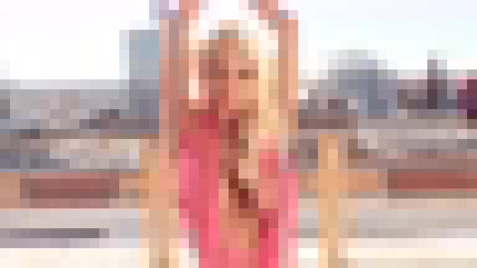
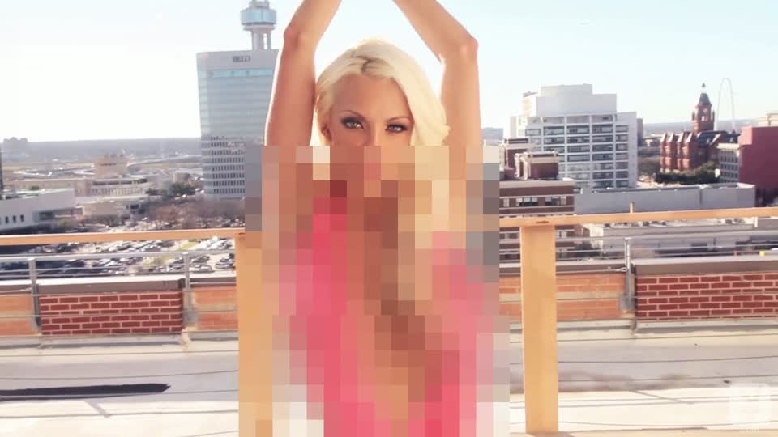
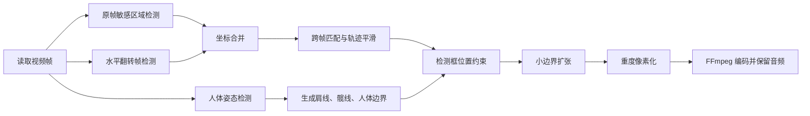

# FrameShield：自动视频隐私马赛克

一个本地运行的视频隐私处理工具。它逐帧识别高风险人体敏感区域，对候选区域施加重度像素化；同时使用人体姿态作为“护栏”和小范围安全兜底，把遮挡限制在合理的躯干/骨盆范围内，避免把脸部一起打码。

> [!WARNING]
> 本项目涉及敏感内容识别。下方“处理前”示例也已经做了整帧安全像素化，仓库不包含原视频、未遮挡帧、处理成片、API 密钥或模型权重。

## 处理效果

| 安全化的处理前示意 | 精准重码处理后 |
| --- | --- |
|  |  |

“处理前”图片不是原始帧，而是先缩小再用最近邻插值放大的安全示意图。它只用于说明画面布局，不提供敏感细节。

## 功能作用

- 对视频每一帧运行敏感区域检测。
- 同时检测原帧和水平翻转帧，减少姿态与方向导致的漏检。
- 使用跨帧跟踪和平滑，降低马赛克闪烁。
- 使用 YOLO Pose 估计人体范围、肩线和髋线，并在胸部/骨盆位置生成小范围安全兜底框。
- 将检测框裁剪到合理的胸部/骨盆区域，避免遮挡脸部、头发、肩部和大块背景。
- 对最终候选区域施加重度像素化马赛克。
- 使用 FFmpeg 编码 H.264 视频，并复制原 AAC 音轨。
- 全程本地处理，不主动上传视频。

## 生成逻辑



### 1. 双向敏感区域检测

每帧分别输入原图和水平翻转图。翻转图检测结果会映射回原坐标系，再与原图结果合并。默认检测阈值为 `0.18`，在召回率和误遮挡之间取平衡。

### 2. 跨帧跟踪

候选框通过 IoU 和归一化中心距离匹配。匹配成功后使用指数平滑更新位置；短时间检测不到时，轨迹保留 `5` 帧，减少闪烁，但不会长时间拖出大面积马赛克。

### 3. 姿态护栏

YOLO Pose 提供人体框、肩部和髋部关键点。程序据此估算每个人的合理躯干/骨盆范围，并生成胸部与骨盆的小范围安全兜底框：

- 胸部类检测框会被限制在肩线以下、髋线以上；
- 骨盆/臀部类检测框会被限制在髋线附近及以下；
- 检测框中心不在任何人体框内时，保留原检测框，避免姿态漏检导致敏感区域不处理。
- 兜底框不会覆盖脸部，但可能比纯检测框多遮挡一些躯干/骨盆区域，以降低漏帧概率。

### 4. 精准重码

候选框四周扩张约 `10%`，并设置最小安全边距，避免只遮住检测框中心。默认马赛克块大小为 `34 px`，遮挡强度更高，优先降低敏感部位漏出概率。

### 5. 视频输出

OpenCV 负责解码与逐帧处理；FFmpeg 从标准输入接收 BGR 帧，以 H.264、CRF 18 编码，并直接复制原音轨。

## 安装

需要 Python 3.10+ 和 FFmpeg：

```bash
python -m venv .venv
source .venv/bin/activate
pip install -r requirements.txt
```

Windows PowerShell：

```powershell
python -m venv .venv
.\.venv\Scripts\Activate.ps1
pip install -r requirements.txt
```

首次运行 Ultralytics 时可自动下载姿态模型，也可以手动准备 `yolo11n-pose.pt`。

## 使用

```bash
python src/auto_mosaic_video.py input.mp4 output.mp4 \
  --ffmpeg /path/to/ffmpeg \
  --pose-model /path/to/yolo11n-pose.pt
```

Windows 示例：

```powershell
python src\auto_mosaic_video.py input.mp4 output.mp4 `
  --ffmpeg C:\ffmpeg\bin\ffmpeg.exe `
  --pose-model .\yolo11n-pose.pt
```

## 关键参数

| 参数 | 默认值 | 作用 |
| --- | ---: | --- |
| 敏感检测阈值 | `0.10` | 越低越不容易漏检，但误遮挡增加 |
| 轨迹保留 | `8` 帧 | 减少短暂漏检造成的闪烁 |
| 姿态置信度 | `0.12` | 控制人体姿态护栏的敏感度 |
| 边界扩张 | `10%` | 防止只遮住检测框中心 |
| 马赛克块 | `34 px` | 数值越大，遮挡越强 |
| H.264 CRF | `18` | 控制输出画质与体积 |

## 代码结构

```text
.
├── README.md
├── requirements.txt
├── src/
│   └── auto_mosaic_video.py
└── docs/
    └── assets/
        ├── before-safe-01.jpg
        └── after-heavy-01.jpg
```

核心函数：

- `merge_nudenet_detections()`：运行原帧与翻转帧检测并合并坐标。
- `update_tracks()`：匹配、平滑并短期保留候选轨迹。
- `pose_guardrails()`：根据人体姿态生成肩线、髋线和人体边界。
- `pose_safety_detections()`：在胸部和骨盆位置生成小范围兜底遮挡框。
- `constrain_sensitive_box()`：把敏感检测框裁剪到合理人体区域，避免误遮挡脸部。
- `mosaic_region()`：小幅扩张候选框并应用重度马赛克。
- `main()`：组织解码、推理、处理和 FFmpeg 输出。

## 已知限制

- 任何自动视觉模型都无法数学保证零漏检。
- 极端遮挡、快速运动、强逆光、小目标或非常规姿态可能降低检测效果。
- 如果将检测阈值调得过低，仍可能产生误遮挡。
- CPU 逐帧处理速度取决于分辨率、模型和硬件。
- 发布前仍建议人工抽检或完整复核。

## 隐私与安全

- 只处理你有权处理的视频。
- 不要提交原视频、未遮挡帧、成片或模型缓存到公开仓库。
- 不要把 API Key、访问令牌或本机绝对路径写入代码。
- 示例素材必须在发布前先进行不可逆遮挡。

## 声明

本项目用于隐私保护、内容合规和本地视频处理研究，不提供识别准确率保证。使用者应对素材权利、人工复核和最终发布结果负责。
